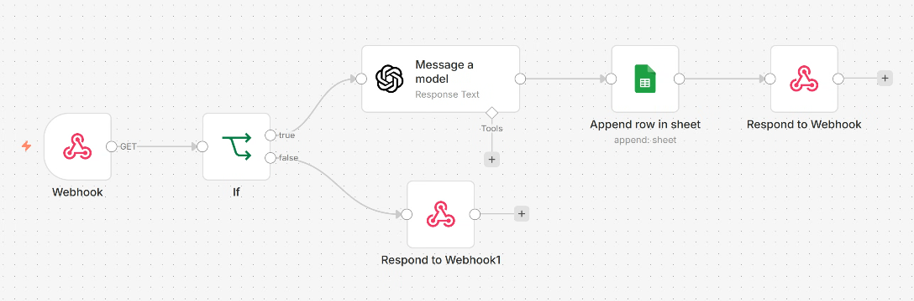
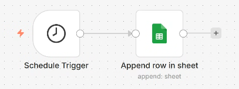

# AI Automation Workflows with n8n

A collection of automation workflows built with n8n, integrating LLM APIs and Google Sheets for real-world AI-powered process automation.

### Workflow 1: AI Chatbot with Conditional Logic & Google Sheets Logging
**What it does:** Receives user input via webhook, runs conditional logic to verify the sender, sends the message to an LLM (LLaMA 3.3-70B via Groq API) for an intelligent response, logs all interactions to Google Sheets automatically, and returns the AI-generated response to the user.
**Tools used:** n8n, Groq API (LLaMA 3.3-70B), Google Sheets, Webhook
**Flow:**
Webhook → IF (check name) → OpenAI/Groq (LLM) → Google Sheets (log) → Respond to Webhook
                          → (false branch) → Respond to Webhook

### Workflow 2: Scheduled Auto-Logger
**What it does:** Runs automatically every minute and logs a status entry to Google Sheets — simulating a real use case like daily automated reporting or system health monitoring. No manual trigger needed.
**Tools used:** n8n, Google Sheets, Schedule Trigger
**Flow:**
Schedule Trigger (every 1 min) → Append Row to Google Sheets

## Tech Stack
* **n8n** — workflow automation engine
* **Groq API / LLaMA 3.3-70B** — LLM for intelligent responses
* **Google Sheets API** — automated data storage and logging
* **Webhook** — HTTP trigger for incoming requests

## Key Concepts Demonstrated
* Webhook triggers and dynamic data handling
* Conditional logic (IF/else branching) in automation
* LLM API integration for AI-powered responses
* Automated data logging to Google Sheets
* Scheduled workflow execution without manual trigger

## What I Learned
Building these workflows taught me how to connect different services together into one automated system. I learned that automation is not just about saving time — it is about making systems that can run reliably without human intervention. Integrating an LLM into a workflow showed me how AI can be a functional part of a process, not just a standalone chatbot. This project gave me a practical understanding of how AI-driven workflows can solve real business problems.
